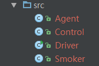
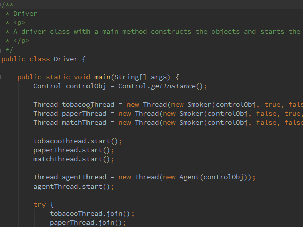
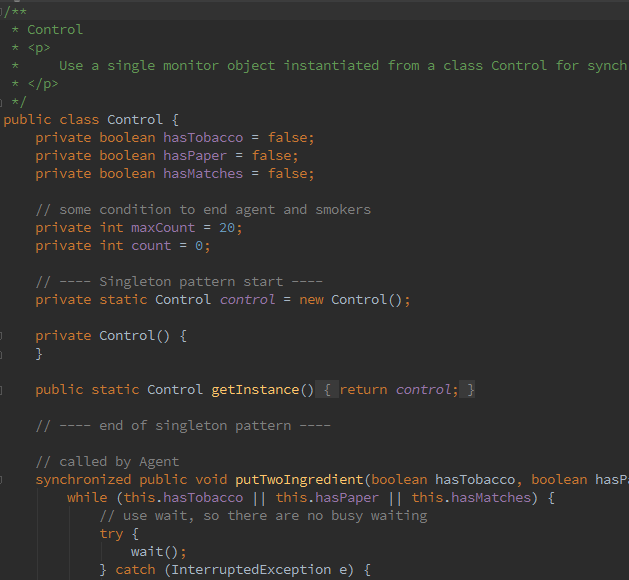
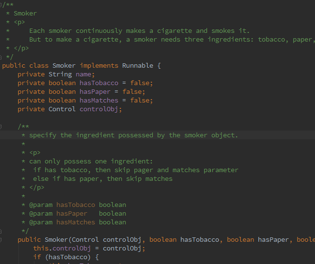
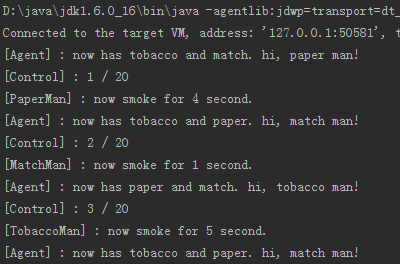

Solution
======

below is sample code: 

* classes
 
    
* driver class
 
    
* Control class
 
    
* Smoker class
 
    
* output
 
    
    * note: you can set max loop count (Control.maxCount) to avoid infinite looping.
    
    